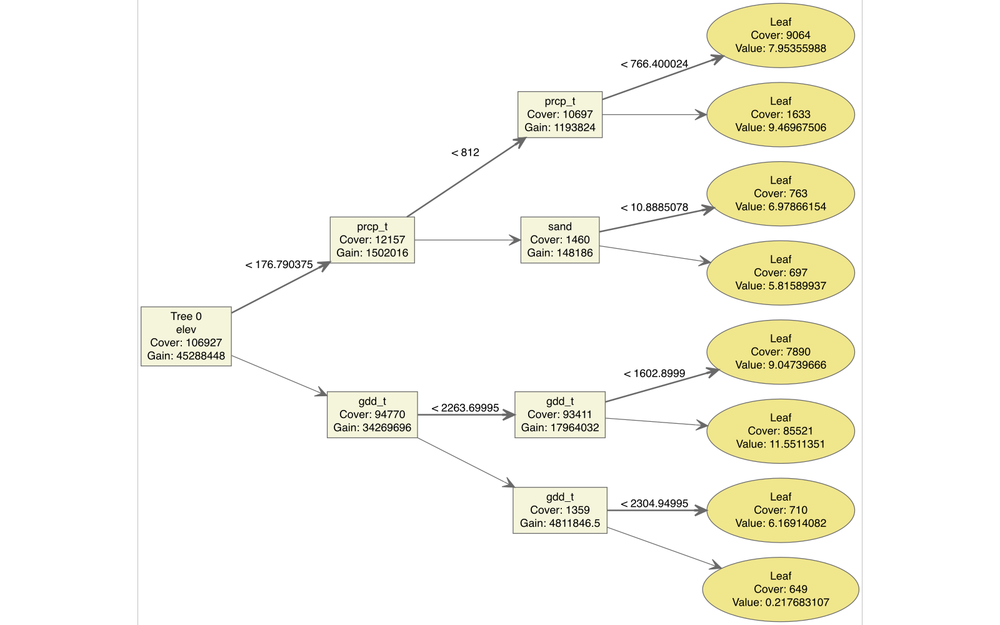

```{r}
library(here)
library(knitr)
library(dplyr)
library(tidyr)
library(readr)
library(gt)

```

To demonstrate the limits of transferring information across OFPE fields, we focus on one representative field that has three replicated OFPE trials conducted over multiple years within a standard crop rotation. This field is not special within the dataset; rather, it is chosen because it contains repeated experiments under comparable management, making it an ideal example of the general patterns observed across the entire sample. Variable-importance profiles and decision-tree structures for all other fields exhibit nearly identical behaviors and are reported in the Appendix.

Figure @fig-vi-panel shows the variable-importance patterns obtained from Random Forest and XGBoost when the chosen field is excluded from the training set under leave-one-location-out (LOLO) cross-validation. Because LOLO removes only the target field in each iteration, and because all other fields remain in the training sample, the training data are nearly identical across years. This results in highly stable variable-importance rankings, which is precisely what we observe. Both RF and XGBoost consistently assign dominant importance to growing degree days, elevation, extreme degree days, and total seasonal precipitation. Soil texture and water-storage variables follow, while nitrogen rate receives only modest importance.  

This pattern reflects a structural feature of the pooled OFPE dataset: most between-field variation in observed yields arises from differences in weather, landscape position, and long-run soil properties, rather than from differences in applied nitrogen rates. Consequently, the models learn that nitrogen plays a relatively small role in explaining the broad cross-field variation. While such rankings are reasonable for predicting average yields across diverse environments, they already signal a key limitation for nitrogen recommendation: the models place limited emphasis on nitrogen when learning from the multi-field dataset, making it difficult to recover field-specific curvature in the yield$–N response when predicting for an unseen field.

```{r fig-vi-panel, echo=FALSE, out.width="100%", fig.cap="Variable importance obtained from Random Forest (top row) and XGBoost (bottom row) under leave-one-location-out training for one representative field. Importance values are scaled within method. The dominant roles of weather, elevation, and site characteristics—and the consistently low weight placed on nitrogen rate—reflect the structure of the pooled multi-field dataset."}

     knitr::include_graphics("Results/Figures/stage1_ensemble/VI_panel_28_5.png")
```

    
Further insight into how the model internalizes these relationships is provided by the first decision tree in the XGBoost ensemble for each of the three replicated trial years (Figures @fig-tree-1–@fig-tree-3). Across all years, the tree begins with splits on elevation and precipitation, followed by growing degree days; only deeper in the tree do soil properties or nitrogen rate appear. The structure is strikingly similar across all replications, which is expected because the LOLO procedure uses almost the same training set for each year. This stability indicates that the model is not adapting to the specific nitrogen–yield structure of the unseen field-year; instead, it relies on a general, weather-and-topography-dominated partition learned from the pooled dataset. Although this representation predicts average yield levels reasonably well, it offers little sensitivity to within-field nitrogen variation—the key requirement for recovering a meaningful nitrogen response.


```{r fig-tree-1, echo=FALSE, out.width="100%", fig.cap="Decision tree from the XGBoost ensemble for the first replicated trial year in the example field. The tree splits primarily on elevation and seasonal precipitation, demonstrating that the model prioritizes environmental gradients over nitrogen when trained on pooled multi-field data."}

    
```

```{r fig-tree-2, echo=FALSE, out.width="100%", fig.cap="XGBoost decision tree for the second replicated trial year. The structure remains nearly identical to the first year, reflecting the fact that under leave-one-location-out cross-validation the training data are almost unchanged across years and that the model consistently relies on weather–topography partitions."}
    knitr::include_graphics("Results/Figures/stage1_ensemble/tree_28_5_2020.png")
```

```{r fig-tree-3, echo=FALSE, out.width="100%", fig.cap="XGBoost decision tree for the third replicated trial year. Despite crop rotation and differing weather conditions, the primary splits again emphasize elevation, precipitation, and growing degree days, illustrating the model's limited sensitivity to nitrogen rate in unseen field-years."}
    knitr::include_graphics("Results/Figures/stage1_ensemble/tree_28_5_2022.png")
```

The limitations of relying on pooled data for nitrogen recommendations become clearest when examining the predicted yield–nitrogen curves. Figure @fig-curves shows the relationship between nitrogen rate and predicted yield for each trial year, comparing the LOLO-trained Random Forest and XGBoost predictions to the field-specific GAM curve estimated from the direct OFPE data. The GAM curves exhibit smooth and interpretable nitrogen responses that differ across years—sometimes showing a clear interior optimum, other times flattening over a wide interval. These differences reflect real variation in weather, soil moisture, and rotational effects.

In contrast, the LOLO-trained machine-learning curves are almost entirely insensitive to nitrogen. Both RF and XGBoost produce step-like or nearly flat yield predictions across the nitrogen range, a direct consequence of nitrogen’s low importance and minimal representation in the tree structures. As a result, the models are unable to recover the curvature of the yield–N response and often push the predicted EONR toward the boundary of the observed N range or leave it essentially unidentified. This mismatch between predicted and realized nitrogen responses is not unique to this example field; similar discrepancies appear across the full set of fields, confirming that the multi-field models fail to transfer actionable nitrogen information to unseen locations.

```{r fig-curves, echo=FALSE, out.width="100%", fig.cap="Yield–nitrogen response curves for three replicated trial years in the example field. Red lines represent the field-specific GAM response estimated from the direct OFPE data; green and blue lines represent Random Forest and XGBoost predictions under leave-one-location-out training. The multi-field models capture average yield levels but fail to reproduce the field-year-specific curvature of the nitrogen response, leading to boundary or poorly identified EONR estimates."}
    knitr::include_graphics("Results/Figures/stage1_ensemble/Curves_28_5.png")
```

Taken together, these findings show that cross-field machine-learning models trained under LOLO cross-validation explain substantial variation in average yield levels across farms but do not deliver transferable nitrogen-response information. The models consistently prioritize environmental gradients—weather, elevation, and stable soil attributes—which dominate cross-field variation. Nitrogen, being relatively small in its contribution to pooled predictive accuracy, receives minimal attention in the learned structures. As a result, although the models generalize well in terms of yield prediction, they fail to generalize in the dimension that matters for nitrogen management: the shape and slope of the yield–N response curve. The full set of fields analyzed in the Appendix reveals the same qualitative behavior, indicating that this limitation is systemic rather than field-specific.

```{r tbl-eonr-comparison, echo=FALSE}
    # Read the combined EONR results -------------------------------

    eonr_all <- read_csv("Results/Tables/EONR_3trial_all.csv",
    show_col_types = FALSE)

    # Recreate the summary (if not already in memory) --------------

    eonr_summary <- eonr_all %>%
    group_by(farm_field, ffy_id, model) %>%
    summarise(
    mean_EONR = mean(EONR, na.rm = TRUE),
    mean_profit = mean(profit_at_EONR, na.rm = TRUE),
    .groups = "drop"
    )

    # Pivot to wide format: one row per field-year -----------------

    eonr_wide <- eonr_summary %>%
    mutate(model = factor(model, levels = c("GAM", "RF", "XGB"))) %>%
    arrange(farm_field, ffy_id, model) %>%
    pivot_wider(
    names_from = model,
    values_from = c(mean_EONR, mean_profit),
    names_sep = "_"
    )

    # Make a clean, compact gt table -------------------------------

    eonr_wide %>%
    arrange(farm_field, ffy_id) %>%
    gt(rowname_col = NULL) %>%
    tab_header(
    title = "Comparison of EONR and profit across models for three-trial fields"
    ) %>%
    cols_label(
    farm_field = "Field",
    ffy_id = "Field-year",
    mean_EONR_GAM = "GAM EONR",
    mean_EONR_RF = "RF EONR",
    mean_EONR_XGB = "XGB EONR",
    mean_profit_GAM = "GAM Profit",
    mean_profit_RF = "RF Profit",
    mean_profit_XGB = "XGB Profit"
    ) %>%
    fmt_number(
    columns = starts_with("mean_EONR"),
    decimals = 0
    ) %>%
    fmt_number(
    columns = starts_with("mean_profit"),
    decimals = 0
    ) %>%
    tab_spanner(
    label = "Economically optimal N rate (lb N/ac)",
    columns = c(mean_EONR_GAM, mean_EONR_RF, mean_EONR_XGB)
    ) %>%
    tab_spanner(
    label = "Profit at EONR ($/ac)",
    columns = c(mean_profit_GAM, mean_profit_RF, mean_profit_XGB)
    ) %>%
    tab_options(
    table.font.size = px(11),
    data_row.padding = px(2)
    ) %>%
    tab_caption(
        caption = "Comparison of the estimated economically optimal nitrogen rates (EONR) and profits across GAM(from direct OFPE data), Random Forest, and XGBoost (trained) models for fields with three replicated OFPE trials. Values are scenario-averaged for each field-year, highlighting how multi-field machine learning models diverge from field-specific GAM benchmarks."
    )

```

Table @tbl-eonr-comparison summarizes the economically optimal nitrogen rates (EONR) and associated profits across all fields with three replicated OFPE trials, comparing the direct field-specific GAM benchmark to the RF and XGBoost models trained under leave-one-location-out. For each field-year, the table reports the mean EONR and the corresponding profit at that EONR under each model, averaged across the price scenarios used in the simulation. A clear pattern emerges from these comparisons: the EONR values predicted by RF and XGBoost frequently diverge substantially from the GAM benchmarks, often falling either well below or well above the field-specific optimum. This systematic mismatch provides direct evidence that the multi-field models, when trained on pooled data, fail to internalize the nitrogen-yield structure relevant for a new, unseen field. In other words, despite strong performance in predicting average yield levels, the RF and XGBoost models offer little transferable information about economically meaningful nitrogen responses, reinforcing the broader limitation documented throughout this section.
